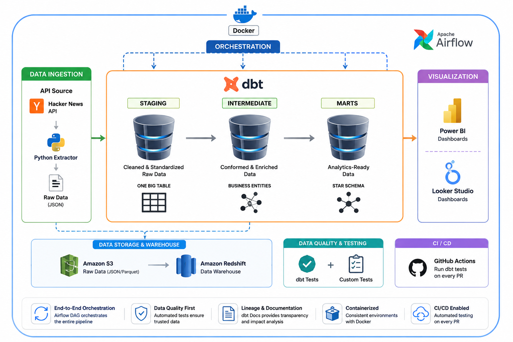

An end-to-end analytics engineering pipeline that ingests story data from the Hacker News API, lands it in Amazon S3, loads it into Redshift, transforms it into analytics-ready marts using dbt, orchestrates the workflow with Apache Airflow, and ships fully containerized with Docker for reproducible deployment and monitoring.

## Overview

This project simulates a production-grade analytics engineering workflow: pulling raw data from an external API, building a tested and documented transformation layer, and delivering trusted, business-ready tables for visualization — all wrapped in CI/CD and containerization.

## Architecture



## Key Features

### Data Ingestion

A custom Python extractor (located in `extraction/`, and mirrored under Airflow's `dags/` for orchestration) pulls raw story data from the Hacker News API. Each run handles new and existing data intelligently:

- **New stories** are appended to the dataset.
- **Existing stories** are updated in place via an `updated_at` column when their underlying data changes.
- **Daily immutability:** Data is only mutable within the current day — if the pipeline runs multiple times on the same day, changed records for existing authors/stories are updated. Once a new day begins, incoming data is appended as new rows rather than overwriting the previous day's data.
- Extracted data is written to disk temporarily before being uploaded to S3 by a dedicated upload script.

### Load to Redshift

A separate script loads the current day's data from S3 into Redshift, ensuring that everything consumed downstream by dbt is up to date.

### Transformation (dbt)

dbt sits on top of Redshift and transforms raw data as it lands in the warehouse, following a three-layer modeling approach:

- **Staging, intermediate, and mart layers**, following dbt best practices.
- **Business-focused marts** built specifically to answer stakeholder questions and power Looker Studio dashboards.
- **Reusable macros** to keep transformation logic DRY and consistent across models.

### Data Quality & Testing

- **Generic dbt tests** (`unique`, `not_null`, `relationships`) applied across all models.
- **Custom singular tests** for business-specific data quality rules.
- **Automated CI runs:** Tests run automatically in CI on every pull request, preventing faulty transformation logic from merging.

### Orchestration

- An **Airflow DAG** orchestrates the full pipeline: `extraction` → `load to Redshift` → `dbt run` → `dbt test`.
- **Astronomer Cosmos Integration:** dbt is integrated into Airflow via Astronomer Cosmos, so each dbt layer (staging, intermediate, marts) becomes its own task/stage within the DAG — improving error visibility, retries, and scalability at the model level.
- Scheduled runs provide task-level visibility into pipeline health and failures.

### Documentation & Lineage

- Auto-generated dbt docs with full column- and model-level lineage graphs.
- Transformation logic made transparent and auditable for non-technical stakeholders.

### Containerization

- The entire codebase (extractor, dbt project, Airflow) is containerized with Docker.
- Enables consistent local development, testing, and deployment environments.

## Tech Stack

| **Layer**            | **Tools**                         |
| -------------------- | --------------------------------- |
| **Ingestion**        | Python, Hacker News API           |
| **Storage**          | AWS S3                            |
| **Warehouse**        | Amazon Redshift                   |
| **Transformation**   | dbt                               |
| **Orchestration**    | Apache Airflow, Astronomer Cosmos |
| **CI/CD**            | GitHub Actions                    |
| **Containerization** | Docker                            |
| **Visualization**    | Looker Studio                     |

## Project Structure

```text
.
├── extraction/          # Python scripts for API extraction & S3 loading
├── hackstories_dbt/
│   ├── models/
│   │   ├── staging/
│   │   ├── intermediate/
│   │   └── marts/
│   ├── macros/
│   └── tests/
├── dags/                # Airflow DAG definitions
├── docker/              # Dockerfiles & docker-compose
└── .github/workflows/   # CI pipeline running dbt tests on PRs
```

## What This Project Demonstrates

- Building a data pipeline end-to-end, from raw API ingestion through to business-ready marts.
- Applying software engineering discipline (testing, CI/CD, version control) to analytics code.
- Designing data models around actual stakeholder questions, rather than raw table dumps.
- Making pipelines observable and auditable through automated documentation and lineage.
- Packaging and deploying the full stack reproducibly with Docker.

## Getting Started

### 1. Clone the repo & Navigate

```bash
git clone <repo-url>
cd hacker-news-analytics-pipeline
```

### 2. Set up credentials

Credentials for the Python scripts (AWS, Redshift, Airflow) can be configured in two ways:

- **Quick start:** Populate a `.env` file with your credentials.
- **Production-style:** Define Airflow connections and use those instead — this is the approach the project currently runs on.

### 3. Build and run

```bash
# Build the Docker image, making sure volume paths match your local repo structure
docker build -t hackstories-pipeline .

# Spin up the containerized stack
docker-compose up -d
```

### 4. Inspect in Airflow

Once the stack is running, open the Airflow UI to inspect the DAG. Thanks to the Astronomer Cosmos integration, each dbt layer (staging, intermediate, marts) appears as its own task within the DAG — making it easy to trace failures back to a specific model and monitor pipeline health at a granular level.
